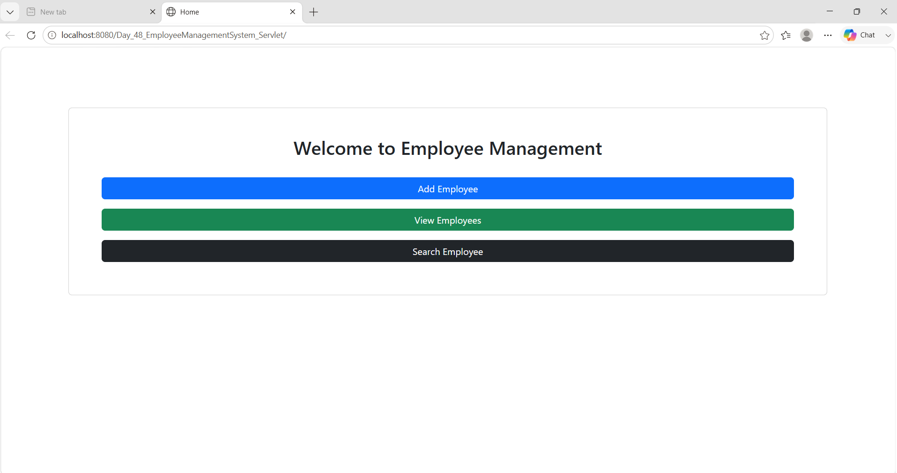
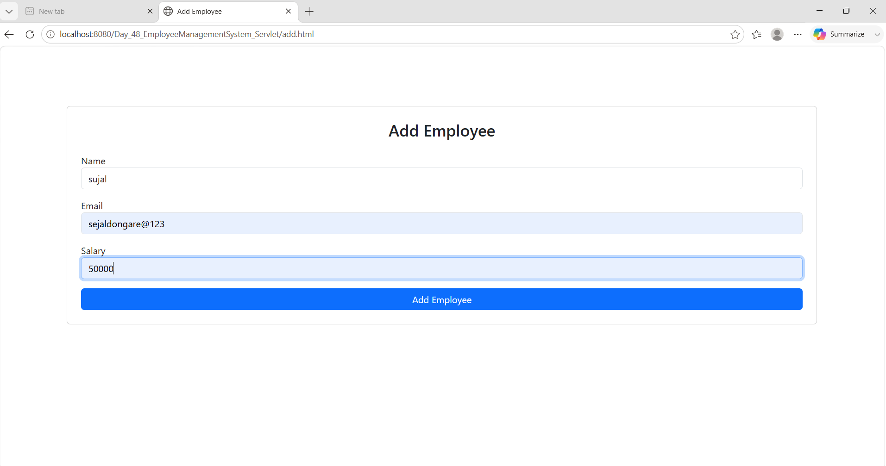
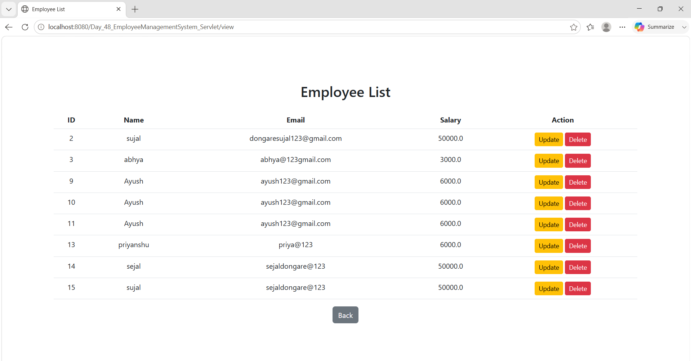
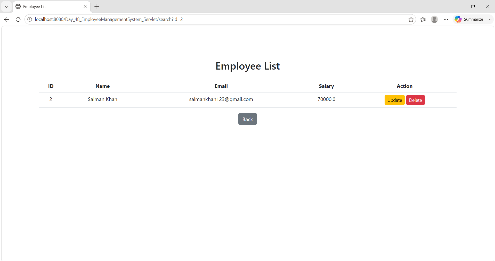
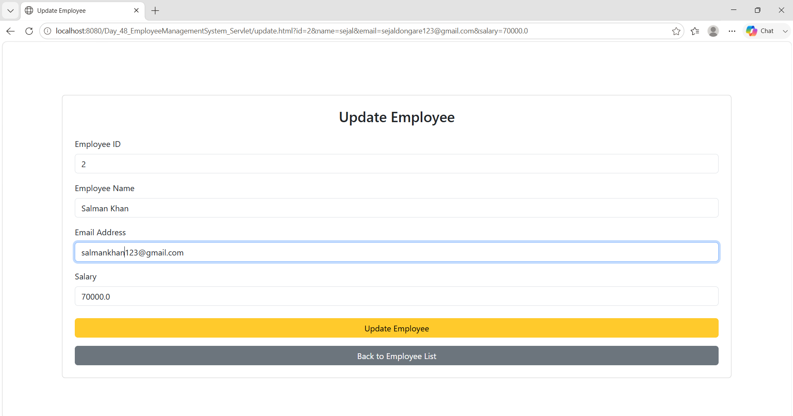
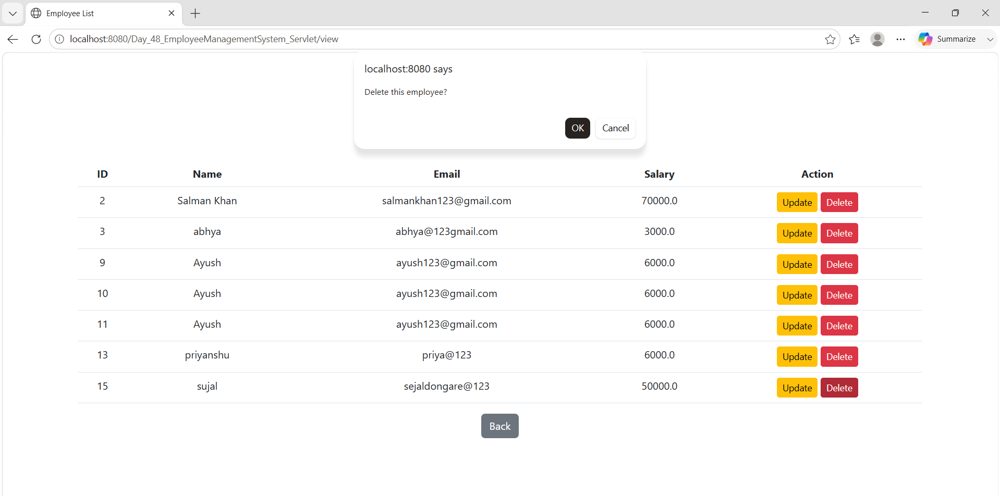
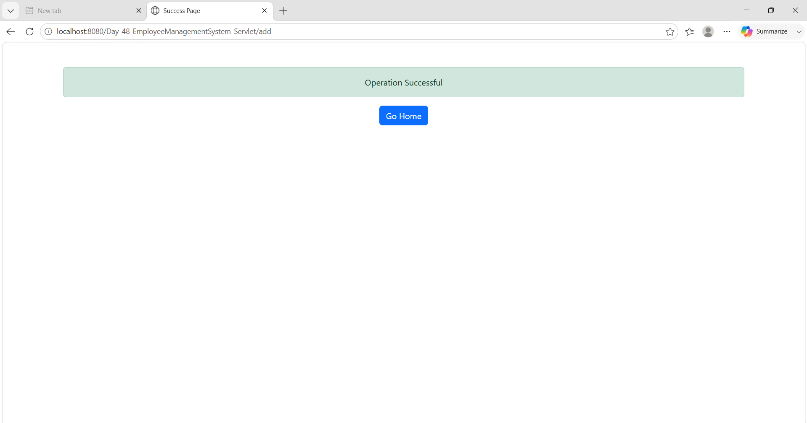

# Day_48_EmployeeManagementSystem_Servlet

Employee Management System built using Java Servlet, JSP, HTML, CSS, JDBC, MySQL, and Apache Tomcat.

## Features

- Add employee
- View employee list
- Search employee
- Update employee details
- Delete employee
- Success and failure pages

## Tech Stack

- Java
- Servlet and JSP
- JDBC
- MySQL
- HTML and CSS
- Apache Tomcat
- Eclipse IDE

## Project Structure

```text
src/main/java       Java source code
src/main/webapp     HTML, JSP, CSS, WEB-INF, and libraries
Screenshot          Application screenshots
employee_db.sql     Database screenshots
```

## Database

This project uses a MySQL database named `empdb`.

The database connection is configured in:

```text
src/main/java/in/soft/factory/ConnectionFactory.java
```

Update the username and password according to your local MySQL setup before running the project.

## How To Run

1. Open Eclipse IDE.
2. Import this folder as an existing Eclipse project.
3. Configure Apache Tomcat in Eclipse.
4. Create the MySQL database `empdb` and required employee table.
5. Run the project on the configured Tomcat server.

## Screenshots

### Home Page



### Add Employee



### Employee List



### Search Employee


### Search Employee Found



### Update Employee



### Delete Employee



### Success Page


